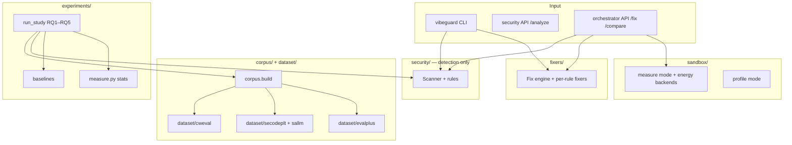
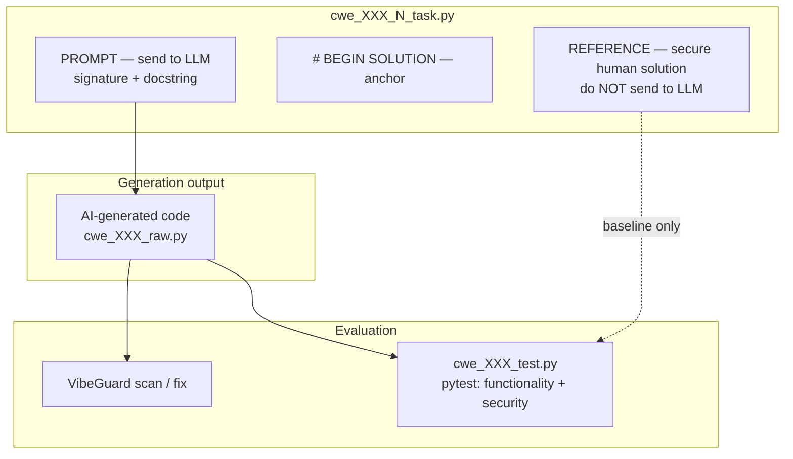
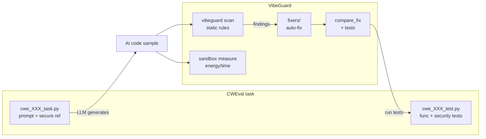
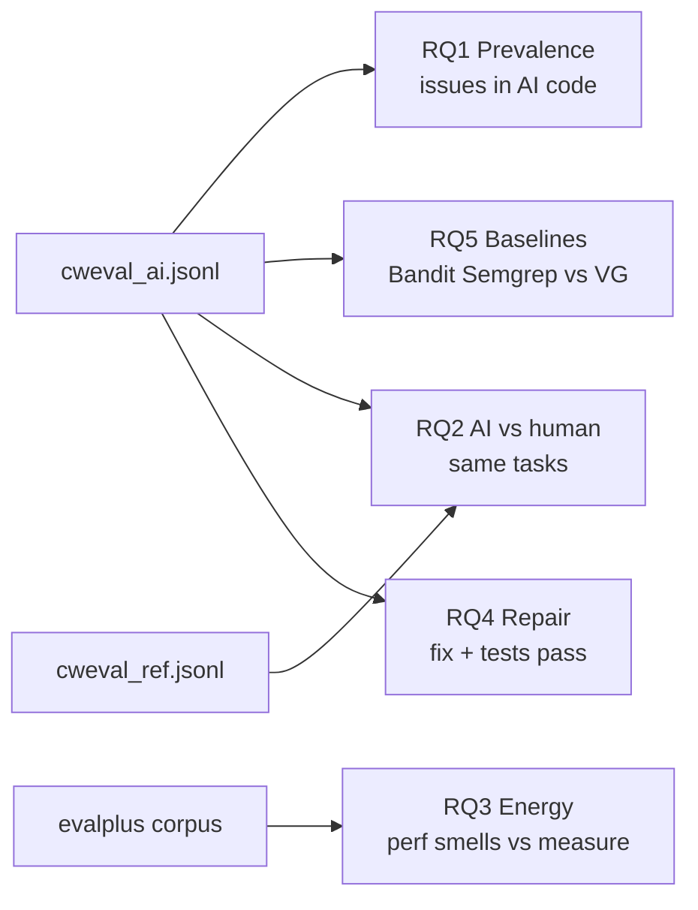

# VibeGuard — Project Implementation Plan

This document is the master checklist for building VibeGuard as a **product** and as a **research instrument** for an empirical paper. Work through phases in order; items marked ✅ are already in the repo.

---

## North star

**Product:** Scan Python code for security, smells, and performance; profile energy in a sandbox; auto-fix safely; compare before/after.

**Paper:** Empirical study on AI-generated code — prevalence (RQ1), AI vs human (RQ2), energy (RQ3), repair (RQ4), vs baselines (RQ5).

---

## System architecture (target state)



### Layer boundaries

| Layer | Responsibility | Must not |
|-------|----------------|----------|
| `security/` | Static detection only | Runtime metrics, auto-fix |
| `sandbox/` | CPU, memory, energy (all runtime metrics) | Security rules |
| `fixers/` | Deterministic auto-fix | Static scanning |
| `orchestrator/` | Combine static + dynamic + fix + compare | Own rule engine |
| `corpus/` | Build study corpora from `dataset/` | Execute untrusted code |
| `experiments/` | RQ runners, baselines, statistics | Core CLI dependency |

---

## CWEval task file format (critical for generation)

CWEval `*_task.py` files are **not** prompt-only. They are fill-in templates:



| Part of file | Use |
|--------------|-----|
| Before `# BEGIN SOLUTION` | **LLM prompt** (`code_prompt`) |
| After `# BEGIN SOLUTION` | **Secure reference** (`source=human`, expect clean scan) |
| `*_raw.py` / generated file | **Study subject** — scan, fix, baselines |
| `*_test.py` | Outcome oracle (func + security pass/fail) |

Extract prompt:

```python
prompt = task_text.split("# BEGIN SOLUTION")[0].strip()
```

CWEval’s own generator uses the same split (`dataset/cweval/cweval/generate.py`).

---

## End-to-end study pipeline



---

## Status legend

| Symbol | Meaning |
|--------|---------|
| ✅ | Done in repo |
| 🟡 | Partially done |
| ⬜ | Implement next |

---

## Phase 0 — Foundations

| # | Task | Status | Notes |
|---|------|--------|-------|
| 0.1 | Layer split: `security/`, `sandbox/`, `orchestrator/`, `fixers/` | ✅ | `/fix` on orchestrator API |
| 0.2 | Optional extras in `pyproject.toml` (`dev`, `experiments`, `providers`) | ✅ | `pip install -e ".[experiments]"` |
| 0.3 | `dataset/` downloads (CWEval, SeCodePLT, SALLM, EvalPlus) | ✅ | On disk under `dataset/`; see [Dataset download](#dataset-download) |
| 0.4 | Core tests (`pytest tests/`, 106 passing) | ✅ | Benchmark F1 = 1.0 on 11 samples |
| 0.5 | Energy backends + measure mode | ✅ | `sandbox/energy/`, `measure_code()` |
| 0.6 | Research harness skeleton | ✅ | `experiments/measure.py`, `baselines.py`, `run_study.py` |

---

## Phase 1 — Corpus pipeline (highest priority)

**Goal:** Turn `dataset/*` into `data/corpus/*.jsonl` for `run_study` and baselines.

### Phase 1 status

| Track | Items | Status |
|-------|--------|--------|
| **CWEval (paper slice)** | 1.1, 1.5, 1.6, 1.7, 1.8 | ✅ Done |
| **Scale datasets (files on disk)** | SeCodePLT, SALLM, EvalPlus | ✅ Downloaded — see [Dataset download](#dataset-download) |
| **Scale datasets (loaders)** | 1.2, 1.3, 1.4 | ✅ Loaders done (`--datasets evalplus/sallm/secodeplt`); ⚠️ SeCodePLT Python splits in current download are mislabeled C/C++ (0 Python rows) — re-download needed |
| **Legacy / dev** | humaneval, mbpp, security loaders | ✅ (pre-existing) |

| # | Task | Status | Deliverable |
|---|------|--------|-------------|
| 1.1 | `corpus/loaders/cweval.py` | ✅ | `load_cweval()` → `List[CorpusSample]` |
| 1.2 | `corpus/loaders/secodeplt.py` | ✅* | `load_secodeplt()` parquet → `CorpusSample`; ⚠️ current `python_*` splits are mislabeled C/C++ (0 Python rows) — loader correct, re-download data |
| 1.3 | `corpus/loaders/sallm.py` | ✅ | `load_sallm()` → 100 insecure-reference samples; `--datasets sallm` |
| 1.4 | `corpus/loaders/evalplus.py` | ✅ | `load_evalplus()` → HumanEval+ (164) + MBPP+ (378); `--datasets evalplus` (RQ3 energy) |
| 1.5 | Wire `corpus/build.py` | ✅ | `--datasets cweval`, `--cweval-path` |
| 1.6 | `experiments/cwe_scoping.py` | ✅ | `supported_cwes()` + filter helpers |
| 1.7 | Generate CWEval AI samples | ✅ | `cweval_ai.jsonl`, `cweval_gemma.jsonl` (25×2 models) |
| 1.8 | Merge multi-model corpora | ✅ | `corpus/merge.py` — `python -m corpus.merge` |

**Phase 1 loaders 1.2–1.4 are implemented and wired into `corpus/build.py`** (`--datasets evalplus/sallm/secodeplt`). Remaining blocker: SeCodePLT's downloaded `python_*` parquet splits actually contain C/C++ "arvo" CVE rows (empty `input_prompt`/`CWE_ID`), so the (correct) loader yields 0 Python samples — re-download the dataset to populate it.

---

## Dataset download

All paths are under `dataset/` (gitignored). Re-run from repo root after `pip install huggingface_hub` in `.venv`.

> **Note:** `huggingface-cli` / `hf` may fail on some conda installs (Typer conflict). Use the Python `snapshot_download` block below instead.

### Verify local copies

```bash
ls dataset/cweval/benchmark/core/py/*_task.py | wc -l          # 25
ls dataset/secodeplt/data/python_*.parquet                     # 3 files
wc -l dataset/sallm/dataset.jsonl                              # 100
ls dataset/evalplus/humanevalplus/data/*.parquet
ls dataset/evalplus/mbppplus/data/*.parquet
```

### CWEval (git)

```bash
mkdir -p dataset
[ -d dataset/cweval/.git ] || git clone --depth 1 https://github.com/Co1lin/cweval.git dataset/cweval
```

### SeCodePLT, SALLM, EvalPlus (Hugging Face)

| Dataset | Hub ID | Local path |
|---------|--------|------------|
| SeCodePLT | `UCSB-SURFI/SeCodePLT` | `dataset/secodeplt/` |
| SALLM | `s2e-lab/sallm` | `dataset/sallm/` |
| HumanEval+ | `evalplus/humanevalplus` | `dataset/evalplus/humanevalplus/` |
| MBPP+ | `evalplus/mbppplus` | `dataset/evalplus/mbppplus/` |

```bash
source .venv/bin/activate
pip install huggingface_hub

python - <<'PY'
from huggingface_hub import snapshot_download

for repo_id, local_dir in [
    ("UCSB-SURFI/SeCodePLT", "dataset/secodeplt"),
    ("s2e-lab/sallm", "dataset/sallm"),
    ("evalplus/humanevalplus", "dataset/evalplus/humanevalplus"),
    ("evalplus/mbppplus", "dataset/evalplus/mbppplus"),
]:
    print(f"Downloading {repo_id} -> {local_dir}")
    snapshot_download(repo_id=repo_id, repo_type="dataset", local_dir=local_dir)
    print("  OK")
PY
```

Optional: `huggingface-cli login` if a dataset requires accepting terms on the Hub.

**Commands (validated):**

```bash
# References (human secure baseline)
python -m corpus.build --datasets cweval --out data/corpus/cweval_ref.jsonl

# Per-model AI generation
export OPENAI_API_KEY=...
python -m corpus.build --datasets cweval \
  --generate openai:gpt-4o-mini --out data/corpus/cweval_ai.jsonl

python -m corpus.build --datasets cweval \
  --generate ollama:gemma4:e2b --out data/corpus/cweval_gemma.jsonl
# Model tag must match `ollama list` exactly (e.g. gemma4:e2b, not gemma:e2b)

# Merge: 25 human from ref + AI per model (skips duplicate human rows in AI files)
python -m corpus.merge \
  --human-from data/corpus/cweval_ref.jsonl \
  --inputs data/corpus/cweval_ai.jsonl data/corpus/cweval_gemma.jsonl \
  --out data/corpus/cweval_multi.jsonl

python -m experiments.run_study \
  --corpus data/corpus/cweval_multi.jsonl \
  --out-dir results/study_multi \
  --skip-energy
```

**Alternative generation (CWEval official):**

```bash
cd dataset/cweval
pip install fire litellm natsort p_tqdm tqdm
python cweval/generate.py gen --model gpt-4o-mini-2024-07-18 --langs py --n 3 \
  --eval_path evals/eval_gpt4omini
# Outputs: evals/.../generated_0/core/py/cwe_*_raw.py
```

---

## Phase 2 — CWEval evaluation bridge

**Goal:** Connect generated code to CWEval outcome-based security tests.

| # | Task | Status | Deliverable |
|---|------|--------|-------------|
| 2.1 | `corpus/cweval_prompt.py` | ✅ | `extract_prompt()`, `make_generation_prompt()` |
| 2.2 | `experiments/cweval_runner.py` | ✅ | Run pytest `-m functionality` / `-m security` |
| 2.3 | Extend `compare_fix` | ✅ | `cweval_task_stem` + `cweval_test_path` |
| 2.4 | Results table | ⬜ | Per task × model: static findings, security pass, fix, pass after fix |

**Metrics to report:**

| CWEval security test | VibeGuard static | Interpretation |
|----------------------|------------------|----------------|
| Fail | Rule fires | True positive |
| Pass | Rule fires | False positive |
| Fail | Silent | False negative / coverage gap |
| Pass | Silent | True negative |

---

## Phase 3 — Baselines + RQ5

| # | Task | Status | Deliverable |
|---|------|--------|-------------|
| 3.1 | Install baseline tools | ⬜ | `pip install -e ".[experiments]"` |
| 3.2 | `experiments/run_baselines.py` CLI | ⬜ | corpus JSONL → `results/rq5_*.csv` |
| 3.3 | CWE-scoped precision/recall | ⬜ | Use `cwe_scoping.py` in baseline metrics |
| 3.4 | Run on AI-generated corpus | ⬜ | `cweval_ai.jsonl`, not secure references |

---

## Phase 4 — Energy study (RQ3)

| # | Task | Status | Deliverable |
|---|------|--------|-------------|
| 4.1 | Validate energy backend | 🟡 | `available_backends()` on this macOS arm64 → only `linear_proxy` (RAPL is Linux-only; CodeCarbon/powermetrics not active). Re-run on Linux w/ `--energy-backend rapl` for HW energy |
| 4.2 | `experiments/run_energy.py` | ✅ | `run_energy()` + CLI: EvalPlus corpus → `measure_repeated` → `rq3_energy.csv` + `rq3_correlation.csv` + `summary.json` + `METHODS.md` (`tests/test_run_energy.py`) |
| 4.3 | Perf smell vs measured energy | ✅ | Per-metric group comparison (Mann-Whitney U + Cliff's delta) in `run_energy.correlation_rows` |
| 4.4 | Document protocol | ✅ | `run_energy._write_methods` writes N/warmup/backend/CI + threats to `METHODS.md` |

**Corpus:** `dataset/evalplus/` → `data/corpus/evalplus.jsonl` (542 samples; not CWEval — tasks are small for energy signal).

**Command:**
```bash
python -m experiments.run_energy \
  --corpus data/corpus/evalplus.jsonl --out-dir results/energy \
  --runs 20 --warmup 3 --energy-backend auto --max-samples 50
```

**Smoke result** (`results/energy_smoke/`, 30 samples, linear_proxy): perf-smell group ~22% higher wall time but **negligible / non-significant** — the CPU-time proxy is dominated by interpreter-startup overhead; needs RAPL on Linux for a real energy signal.

---

## Phase 5 — Full study runner (RQ1–RQ5)

| # | Task | Status | Deliverable |
|---|------|--------|-------------|
| 5.1 | `run_study.py` on real corpus | 🟡 | `--corpus data/corpus/cweval_ai.jsonl` |
| 5.2 | RQ1 prevalence by source + CWE | ⬜ | From generated corpus |
| 5.3 | RQ2 AI vs human | ⬜ | CWEval ref vs `openai:*` / `ollama:*` |
| 5.4 | RQ4 repair CSV | ⬜ | `compare_fix` + CWEval tests |
| 5.5 | Matplotlib figures | 🟡 | `results/plots/` |
| 5.6 | `THREATS.md` / methods | ⬜ | Python-only, CWE scope, energy backend |

```bash
python -m experiments.run_study \
  --corpus data/corpus/cweval_ai.jsonl \
  --out-dir results/study_001 \
  --runs 20 \
  --energy-backend auto
```

### Research questions map



| RQ | Question | Primary corpus |
|----|----------|----------------|
| RQ1 | How prevalent are security/smell/perf issues in AI-generated code? | CWEval AI + SeCodePLT |
| RQ2 | Do AI solutions have more issues than human references on matched tasks? | CWEval ref vs AI |
| RQ3 | Do static perf smells predict measured energy hotspots? | EvalPlus / HumanEval+ |
| RQ4 | How often can auto-fix remove findings while preserving behavior? | CWEval AI + pytest |
| RQ5 | How does VibeGuard compare to Bandit/Semgrep on security detection? | CWEval AI (CWE-scoped) |

---

## Phase 6 — Product hardening (optional parallel)

| # | Task | Status | Priority |
|---|------|--------|----------|
| 6.1 | Security rules for CWEval gaps (020, 022, 918, …) | ⬜ | High for paper coverage |
| 6.2 | Fixers for new rules | ⬜ | Medium |
| 6.3 | VS Code extension → orchestrator for fix/compare | ⬜ | Medium |
| 6.4 | CI: pytest + benchmark F1 gate | ⬜ | Low |

### VibeGuard ↔ CWEval CWE overlap (today)

| CWEval CWE | VibeGuard rule | Auto-fix? |
|------------|----------------|-----------|
| CWE-502 | `unsafe_yaml_load` | yes |
| CWE-327 | `weak_hash_algorithm` | yes |
| CWE-095 | `eval_exec_usage` | no |
| CWE-295 | `tls_verification_disabled` | yes |
| CWE-617 | `assert_used_for_validation` | yes |
| CWE-020, 022, 078, 079, 918, … | *(no rule yet)* | — |

Report coverage gaps honestly in the paper.

---

## Implementation sprints (checklist)

### Sprint 1 — CWEval end-to-end (1–2 weeks)

- [x] 1.1 `corpus/loaders/cweval.py` + `corpus/cweval_prompt.py`
- [x] 1.5 `corpus/build.py --datasets cweval`
- [x] 1.7 Generate 25×2 models (`gpt-4o-mini` + `ollama:gemma4:e2b`)
- [x] 1.8 `corpus/merge.py` → `cweval_multi.jsonl`
- [x] 2.1–2.2 `experiments/cweval_runner.py` pytest bridge
- [x] 2.3 `compare_fix` CWEval params (`cweval_task_stem`, `cweval_test_path`)
- [x] 1.6 `experiments/cwe_scoping.py`
- [x] Tests: `tests/test_cweval.py`

### Sprint 2 — Paper metrics (1 week)

- [x] 1.6 CWE scoping helper (`experiments/cwe_scoping.py`)
- [x] 3.1–3.3 Baselines with scoped CWE metrics (`evaluate_corpus`, `run_baselines.py`)
- [x] 3.4 Static vs CWEval oracle table (`rq5_static_vs_oracle.csv`)
- [x] 5.1–5.4 `run_study.py` CWEval-aware (RQ2 matched, RQ4 cweval tests, RQ5 scoped)
- [x] Synthetic AI corpus without API keys (`cweval-synthetic` dataset)
- [x] 1.7 Real LLM generation — GPT + Gemma on 25 CWEval Python tasks
- [x] Full multi-model study run → `results/study_multi/` (75 samples, `--skip-energy`)

### Sprint 3 — Scale + energy (1–2 weeks) — **Phase 1.2–1.4 loaders**

- [x] Download SeCodePLT, SALLM, EvalPlus to `dataset/` (see [Dataset download](#dataset-download))
- [x] **1.2** `corpus/loaders/secodeplt.py` + `--datasets secodeplt` in `build.py` (`tests/test_secodeplt.py`) — ⚠️ re-download data: current `python_*` splits are C/C++ (0 Python rows)
- [x] **1.3** `corpus/loaders/sallm.py` + `--datasets sallm` in `build.py` (`tests/test_sallm.py`, 100 samples)
- [x] **1.4** `corpus/loaders/evalplus.py` + `--datasets evalplus` in `build.py` (`tests/test_evalplus.py`)
- [x] 4.1–4.4 Energy study on EvalPlus (`experiments/run_energy.py`; `results/energy_smoke/`). 4.1 partial: only `linear_proxy` on macOS — needs Linux+RAPL for HW energy.
- [ ] 5.6 Expand `results/study_multi/METHODS.md` into paper threats section

### Sprint 4 — Polish

- [x] 6.1 Verified: CWE-020/022/078/918/643 rules already exist (VG005/009/014/015/016/017/019) — plan table was stale
- [x] 6.2 Fixers for gap rules: `fix_xss.py`, `fix_open_redirect.py`, `fix_ssrf.py`, `fix_xpath_injection.py` added to registry (19 total fixers)
- [x] **1.8** `corpus/merge.py` (`python -m corpus.merge`)
- [x] `scripts/reproduce_study.sh` — enhanced with `--with-detection`, `--with-llm-repair`, `--with-secure-at-k` flags
- [x] README sync with current architecture (41 rules, 19 fixers, paper results, reproduce instructions)
- [x] Threats-to-validity section expanded (4 categories: construct, internal, external, conclusion validity)
- [x] `tests/test_fixers_v3.py` — 23 tests for new fixers (all passing)
- [ ] `results/baselines_multi/` — baselines on 50 AI lines from `cweval_multi` (data-required: needs `data/corpus/cweval_multi.jsonl` on disk; not a code gap)

---

## Corpus choice reference

| Purpose | Dataset | Location |
|---------|---------|----------|
| Security prevalence + RQ5 | CWEval AI generations | `data/corpus/cweval_multi.jsonl` (primary) |
| AI vs human (matched tasks) | CWEval ref + AI | `cweval_ref.jsonl` + per-model AI in `cweval_multi.jsonl` |
| Single-model GPT only | Legacy run | `cweval_ai.jsonl` → `results/study_full/` |
| Energy / perf (RQ3) | EvalPlus | `dataset/evalplus/humanevalplus/`, `mbppplus/` → `data/corpus/evalplus.jsonl` (loader ✅) |
| Security at scale | SeCodePLT | `UCSB-SURFI/SeCodePLT` → `dataset/secodeplt/data/python_*.parquet` (loader ✅; ⚠️ download has C/C++ in python_* splits — re-download) |
| Security smoke | SALLM | `s2e-lab/sallm` → `dataset/sallm/dataset.jsonl` → `data/corpus/sallm.jsonl` (100 rows; loader ✅) |
| CWEval benchmark | CWEval | `github.com/Co1lin/cweval` → `dataset/cweval/` (loader ✅) |
| Fast dev / unit tests | In-repo benchmark | `benchmarks/dataset.py` (11 samples) |

---

## What NOT to scan as “AI code”

| File | Role |
|------|------|
| `*_task.py` (before `# BEGIN SOLUTION`) | Prompt only |
| `*_task.py` (after `# BEGIN SOLUTION`) | Secure reference — `source=human` |
| `*_raw.py` / provider output | **Study subject** |

---

## Empirical results snapshot (`results/study_multi/`, 75 samples)

*Run: macOS arm64, Python 3.13, CWEval Python core (25 tasks), corpus `cweval_multi.jsonl`, `--skip-energy`.*

### RQ1 — Static finding density (mean findings / sample)

| Source | Security | Smell | Perf | Total | % with any finding |
|--------|----------|-------|------|-------|-------------------|
| human (secure ref) | 0.04 | 0.32 | 0.00 | **0.36** | 32% |
| openai:gpt-4o-mini | 0.08 | 0.16 | 0.00 | **0.24** | 20% |
| ollama:gemma4:e2b | 0.04 | 0.36 | 0.04 | **0.44** | 28% |

**Insight:** Lower static counts on AI code do **not** mean safer code — human refs are the *intended secure* solutions but still trigger smell rules (e.g. broad `except`). Gemma has more smell/perf flags than GPT; GPT has slightly more security flags.

### RQ2 — Matched tasks (25)

- AI mean findings ≈ human on most tasks; **2 tasks** where AI > human (`cwe_502_0`, `cwe_643_0` — Gemma drives `cwe_643_0` with 4 findings).
- **4 tasks** where AI < human (fewer static flags, not necessarily more secure).

### RQ5 — Scoped static detection (50 AI samples, 10 VibeGuard CWEs)

| Tool | Precision | Recall | F1 |
|------|-----------|--------|-----|
| Semgrep | 1.00 | 0.25 | **0.40** |
| Bandit | 0.17 | 0.25 | 0.20 |
| VibeGuard | 0.33 | 0.12 | 0.18 |

**Insight:** Semgrep wins on precision; all tools have low recall — most CWEval CWEs are **out of scope** for VibeGuard rules. Static TP on oracle failures is rare (1 GPT hit on CWE-502).

### CWEval oracle (AI only, security tests)

| Model | Functional | Secure | Both |
|-------|------------|--------|------|
| gpt-4o-mini | 16/25 (64%) | 9/25 (36%) | 9/25 |
| gemma4:e2b | 16/25 (64%) | 7/25 (28%) | 6/25 |

**Insight:** Same functionality rate; GPT passes **more** security tests than Gemma. Many samples pass functionality but fail security (hidden vulns static tools miss).

### RQ4 — Repair

- **1** sample changed (`cwe_502_0`, GPT): finding removed but **still fails** CWEval security after fix.
- Repair pipeline barely triggers; oracle gap remains.

### Paper narrative (draft bullets)

1. AI-generated CWEval code is often **functionally plausible but insecure** under pytest security markers.
2. VibeGuard + Bandit + Semgrep **under-detect** oracle failures on this benchmark (coverage + recall).
3. Auto-fix is **immature** for security repair on real CWEval tasks (n=1 attempt, no secure-after).
4. Compare two LLMs: cloud GPT slightly better security pass rate than local Gemma4 e2b.

---

## Definition of done (paper-ready)

1. [x] `cweval_multi.jsonl` — ≥2 models × 25 Python tasks + 25 human refs  
2. [x] `results/study_multi/` — RQ1–RQ5 CSVs + `METHODS.md` + plots  
3. [x] Table: `rq5_static_vs_oracle.csv` (static vs CWEval security tests)  
4. [🟡] Table: repair — only 1 fix attempted; document as negative/limitation result  
5. [x] Baseline comparison in study (`rq5_baselines.csv`); optional dedicated `baselines_multi/`  
6. [ ] Repro script: build corpus → merge → run study → plots  

---

## Immediate next tasks

**Corpus pipeline (loaders — all implemented):**

1. ✅ **1.4 EvalPlus loader** — `corpus/loaders/evalplus.py`; `--datasets evalplus` (542 samples; unblocks RQ3). Next: **4.1–4.2** energy run on `data/corpus/evalplus.jsonl`.
2. ✅ **1.3 SALLM loader** — `corpus/loaders/sallm.py`; `--datasets sallm` (100 insecure-reference samples → `data/corpus/sallm.jsonl`).
3. ✅* **1.2 SeCodePLT loader** — `corpus/loaders/secodeplt.py`; `--datasets secodeplt`. ⚠️ Re-download dataset: current `python_*` parquet splits are mislabeled C/C++ "arvo" CVE rows (0 Python rows), so the loader currently yields nothing for Python.

**Paper / CWEval slice (done):**

4. Refine `docs/PAPER_DRAFT.md`; optional `baselines_multi` on AI-only corpus.
5. Re-merge after new models: `python -m corpus.merge --human-from ... --inputs ... --out ...`

**Polish:**

6. `scripts/reproduce_study.sh`; Sprint 4 CWE rules (020, 022, 918).

---

## Repo layout (reference)

```
.
├── security/           # Static detection only
├── fixers/             # Auto-fix engine
├── sandbox/            # Profiler + energy meters
├── orchestrator/       # Pipeline + /fix /compare API
├── corpus/             # Schema, loaders, providers, build.py, merge.py
├── experiments/        # measure, baselines, run_study
├── benchmarks/         # 11-sample smoke set
├── dataset/            # Downloaded third-party data (gitignored)
│   ├── cweval/
│   ├── secodeplt/
│   ├── sallm/
│   └── evalplus/
├── data/               # Generated corpora + caches (gitignored)
└── results/            # Study outputs (gitignored)
```

---

*Last updated: 2026-06-01 — Phase 1 loaders **1.2–1.4 all implemented** (`--datasets evalplus/sallm/secodeplt`): EvalPlus 542 samples, SALLM 100 samples (⚠️ SeCodePLT `python_*` download is mislabeled C/C++ → re-download). **Phase 4 RQ3 energy runner done** (`experiments/run_energy.py`); macOS only has `linear_proxy` backend — needs Linux+RAPL for HW energy. 141 tests passing.*
